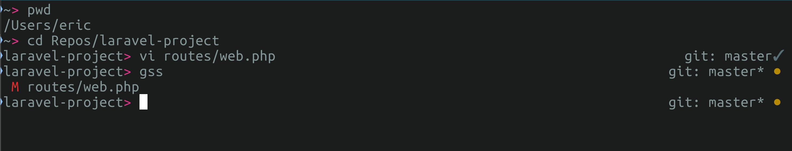

# shocm zsh themes

There are actually 2 zsh themes in this repo. The primary one being `shocm.zsh-theme` which is heavily influenced (and forked from) my friend [TJ Miller's](https://github.com/sixlive) repo https://github.com/sixlive/sixlive-zsh-theme. It is meant to be a clean interface.

The second theme is `shocm2.zsh-theme`. I am sure that theme was also influced by another theme but it's been so long I honestly can't remember where I started that theme from.

## Preview

shocm


shocm2


## Installation

1. Ensure your `ZSH_CUSTOM` variable is set in your `.zshrc` file (`ZSH_CUSTOM=$HOME/.oh-my-zsh-custom`)
2. In your `ZSH_CUSTOM` add the `shocm.zsh-theme` to `themes/`.
3. Activate the theme `ZSH_THEME="shocm"` in your `.zshrc` file

Custom theme directory example after install:

```
/Users/shocm/.oh-my-zsh-custom/
└── themes
    └── shocm.zsh-theme
```

## Contributing

Please see [CONTRIBUTING](CONTRIBUTING.md) for details.

## Security

If you discover any security related issues, please email oss@diego.dev instead of using the issue tracker.

## License

The MIT License (MIT). Please see [License File](LICENSE) for more information.
